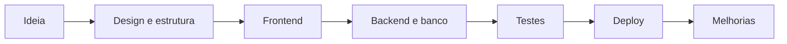

<div align="center">

# Pedro Cerqueira Cavalcante

### Desenvolvedor web focado em transformar ideias em sistemas reais

Construo sites, apps e plataformas digitais com frontend, backend, banco de dados e deploy em cloud.

[](https://github.com/Pedrocerqueiracavalcante)
[](https://easyclean.cerqueirapedro275.workers.dev)
[](https://www.linkedin.com/in/pedrocerq/)

</div>

---

## Resumo rapido

```ts
const pedro = {
  foco: "Desenvolvimento web full-stack",
  objetivo: "Criar produtos digitais bonitos, uteis e prontos para uso real",
  frontend: ["React", "Next.js", "Tailwind CSS"],
  backend: ["APIs", "Cloudflare Workers", "Node.js"],
  database: ["Cloudflare D1", "SQLite", "Drizzle ORM"],
  aprendendoSempre: true,
};
```

## O que eu faco

- Crio landing pages modernas, responsivas e com boa apresentacao visual.
- Desenvolvo sistemas com login, area do cliente, dashboard e painel admin.
- Integro banco de dados, pagamentos, email e WhatsApp.
- Faco deploy em cloud e preparo projetos para ficarem online.
- Organizo projetos para serem apresentados no GitHub de forma profissional.

## Projeto principal

### Easy Clean Luxembourg

Plataforma para uma lavandaria ao domicilio em Luxembourg.

| Area | O que foi feito |
|---|---|
| Site | Landing page moderna, responsiva e animada |
| Cliente | Home, pedidos, historico, tracking, perfil e subscricao |
| Admin | Dashboard e gestao de pedidos |
| Idiomas | PT, EN, FR, DE e ES |
| Cloud | Deploy em Cloudflare Workers |
| Banco | Cloudflare D1 com Drizzle ORM |

<div>

[](https://easyclean.cerqueirapedro275.workers.dev)
[](https://github.com/Pedrocerqueiracavalcante/easyclean)

</div>

## Linguagens que ja usei

<div>


</div>

## Stack e ferramentas

### Frontend


### Backend e banco


### Integracoes


### Ferramentas


## Como penso um projeto



## Roadmap pessoal

- Aprofundar em arquitetura full-stack.
- Criar mais projetos publicados em cloud.
- Melhorar automacoes e integracoes com APIs.
- Evoluir design de interfaces e experiencia do usuario.
- Construir um portfolio com projetos reais.

## Estatisticas

<div align="center">


</div>

## Contacto

- GitHub: [@Pedrocerqueiracavalcante](https://github.com/Pedrocerqueiracavalcante)
- LinkedIn: [linkedin.com/in/pedrocerq](https://www.linkedin.com/in/pedrocerq/)
- Projeto online: [Easy Clean Luxembourg](https://easyclean.cerqueirapedro275.workers.dev)

---

<div align="center">

Aberto a aprender, melhorar e construir projetos cada vez mais completos.

</div>
